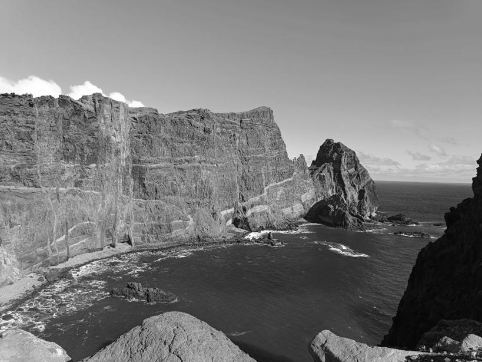
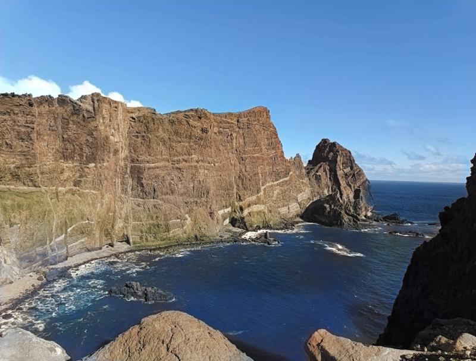

# CNN Image Colorization

This project implements a neural network that predicts the *a* and *b* color channels of an image in the Lab color space, given the *L* (Lightness) channel.


| Grayscale Input (L channel) | Colorized Output |
|----------------------------|------------------|
|  |  |


While inspired by **"Colorful Image Colorization" (Zhang et al.)**, this implementation diverges in architecture and training strategy.

* **Automatic Model Download:** The script automatically fetches the pre-trained weights (`.pth`) upon first use.
* **Architecture:** This model uses a **U-Net** with a pre-trained **ResNet34 encoder** and **Squeeze-and-Excitation (SE) blocks**.
* **GAN Fine-Tuning:** The model was fine-tuned using a Generative Adversarial Network approach.


## Requirements

* Python
* Git (required to clone the repository)


## **Installation**

**Clone the repository:**
```
git clone https://github.com/LostInDimensions/CNN_colorizer
```
**Install dependencies:**
```
pip install -r requirements.txt
```

## **Usage**

**Colorize a default test image**

By default, the script looks for an image at `imgs/test_img1.jpg`.
```
python colorizer.py
```

**Colorize your own image**

You can specify any image path using the `--image` argument:
```
python colorizer.py --image your_image_path.jpg
```

**Note:** The model weights will be downloaded automatically (~106 MB) the first time you run the script. 


## Image Resolution

The model was trained on images with a resolution of **256×256** pixels.  
It generalizes well to higher resolutions, and larger images can be colorized without resizing.

There is no strict resolution limit. However, **artifacts may become more noticeable for very large images**, typically starting around **~1200×1200 pixels and above**, depending on image content.


## **Credits & References**

This project is an independent implementation inspired by the research of Zhang et al. While the architecture and training strategy (ResNet+UNet+GAN) differ from the original paper, it relies on the same color quantization method.

If you find this approach useful, please consider citing the original authors who pioneered this method: 

```
@inproceedings{zhang2016colorful,
  title={Colorful Image Colorization},
  author={Zhang, Richard and Isola, Phillip and Efros, Alexei A},
  booktitle={ECCV},
  year={2016}
}

@article{zhang2017real,
  title={Real-Time User-Guided Image Colorization with Learned Deep Priors},
  author={Zhang, Richard and Zhu, Jun-Yan and Isola, Phillip and Geng, Xinyang and Lin, Angela S and Yu, Tianhe and Efros, Alexei A},
  journal={ACM Transactions on Graphics (TOG)},
  volume={9},
  number={4},
  year={2017},
  publisher={ACM}
}
```
